# 学习目标

*  搭建R编程环境
*  熟悉R语言基础操作
*  编写R函数
*  使用Rmarkdown文档
*  编写R程序包
*  使用git和github进行版本控制

# 要安装的软件

操作系统  Windows 10

* R (https://www.r-project.org/) # Windows
* Rtools (https://cran.r-project.org/bin/windows/Rtools/) #
* MikTeX (https://miktex.org/download)
* Rstudio (https://www.rstudio.com/)
* git (https://git-scm.com/)

# 要安装的文本编辑器

* Rstudio (https://www.rstudio.com/)
* Notepad++ (https://notepad-plus-plus.org/download/)
* atom (https://atom.io/)

# 要安装的R程序包

```R
install.packages("devtools", dependencies = TRUE)
install.packages("rticles")
install.packages("ape")
install.packages("vegan")
install.packages("picante")
install.packages("EcoSimR")
install.packages("HK80")
install.packages("lubridate")
```

# 将Rcmd.exe添加到启动路径

*  R默认安装在 （请注意R的版本）:

`C:\Program Files\R\R-3.5.0\bin\i386`

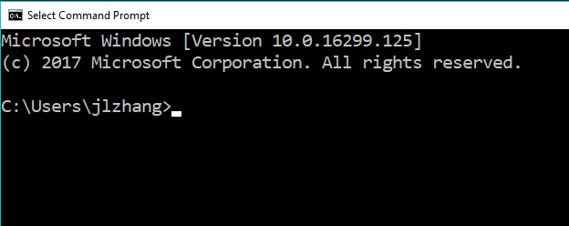{ width=80% }


# 添加启动路径 1
我的电脑，右键，属性

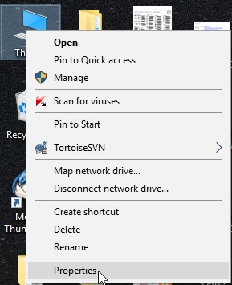{ width=40% }

# 添加启动路径 2
导航栏，我的电脑，右键，属性

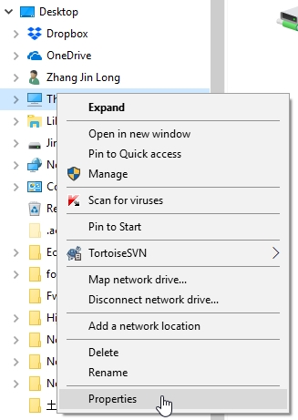{ width=30% }

# 添加启动路径3
Windows10 系统页面

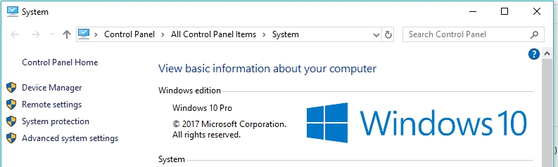{ width=90% }

# 添加启动路径4
系统属性窗口，点击环境变量按钮

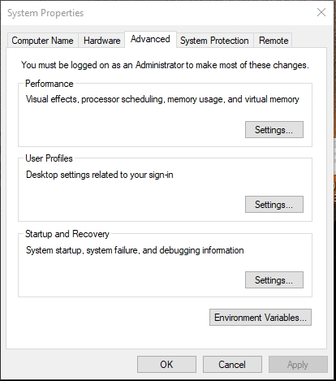{ width=40% }

# 添加启动路径5
在下面一栏，系统变量中，找到PATH变量，点击“编辑 Edit”

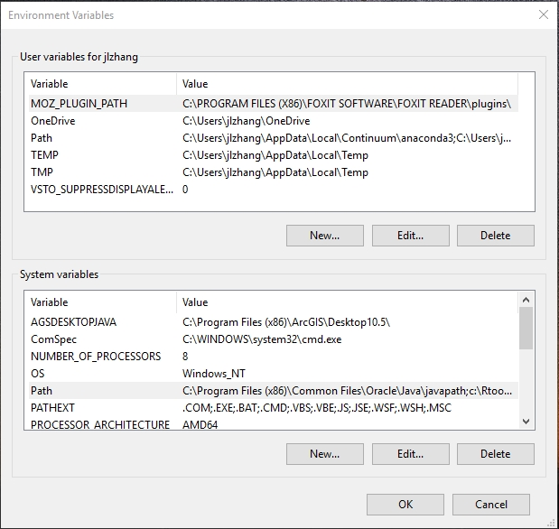{ width=50% }

# 添加启动路径6
编辑环境变量窗口，点击新建New

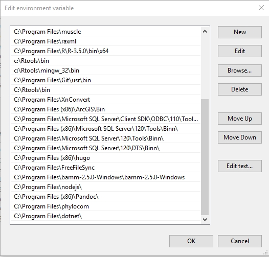{ width=50% }

# 添加启动路径7
找到R安装路径1

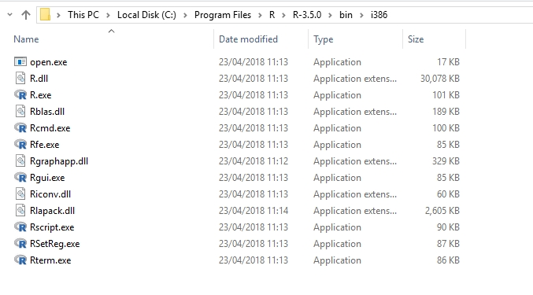{ width=80% }

# 添加启动路径8
拷贝R安装路径2

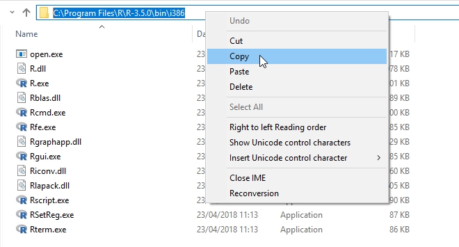{ width=80% }

# 添加启动路径之后9
添加到Path之后，点击确定，关闭所有窗口

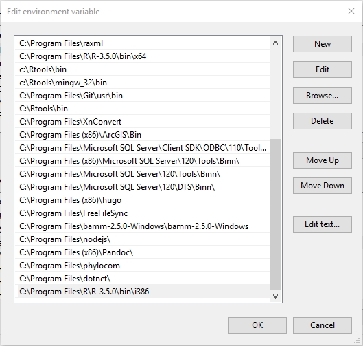{ width=50% }

# MikTeX安装

选择32bit版本，下载和安装。因为64bit软件与64位系统并不是完全兼容。

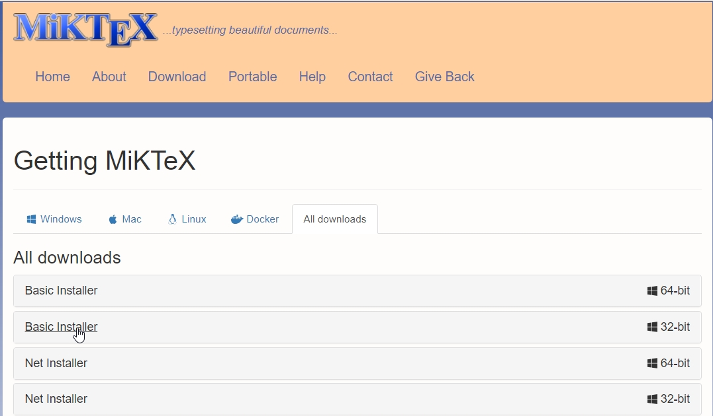{ width=80% }

# 检查软件安装：调用cmd

Windows，在搜索>输入cmd>提示 Command Prompt

{ width=80% }

# 检查软件安装：Rcmd
添加R的启动路径，在command prompt中输入Rcmd检查

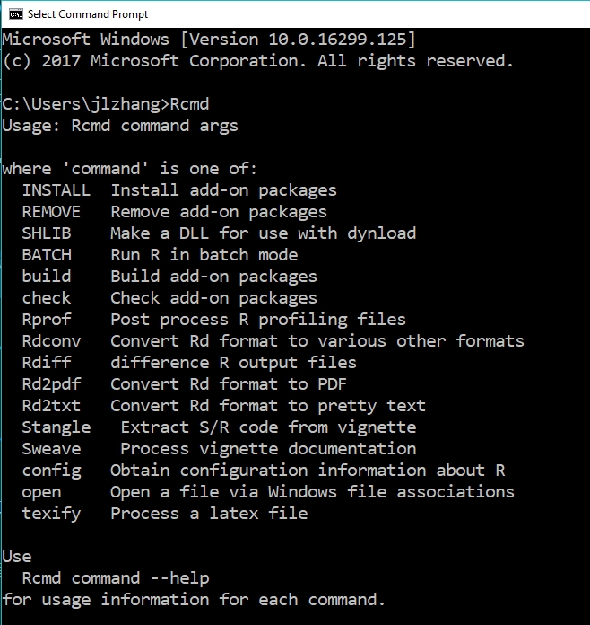{ width=50% }

# 检查软件安装：Rtools
若Rtools已经安装好，则应在command prompt输入gcc检查

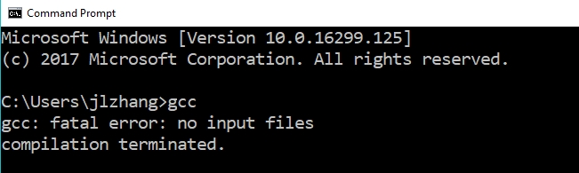{ width=80% }

# 检查软件安装：MikTeX
若MikTeX已经安装好，则应在command prompt输入pdflatex检查

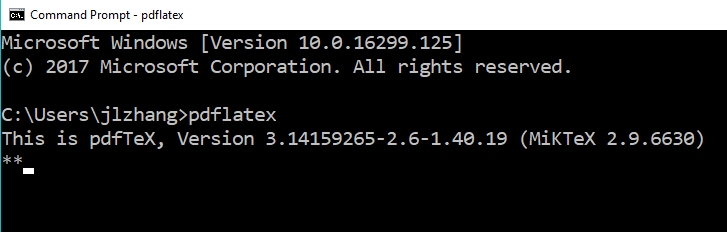{ width=80% }

# 检查软件安装：git
若git已经安装好，则应在command prompt输入git检查

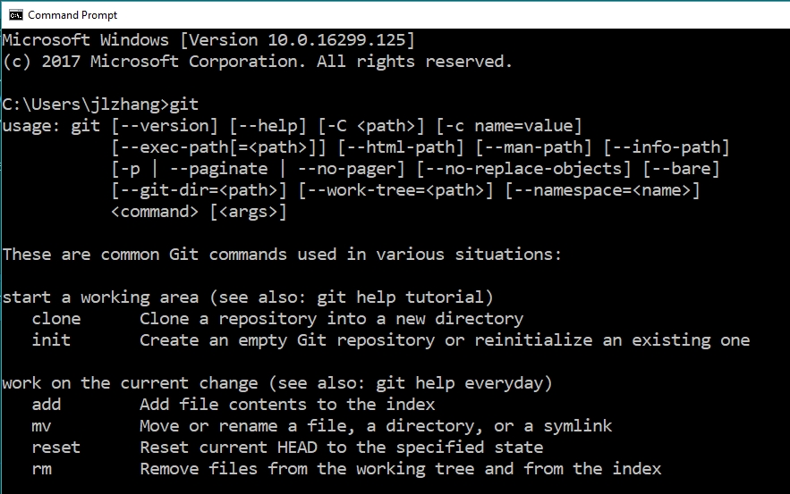{ width=70% }


# MikTeX下载编译beamer用的字体

请先用Studio打开./beamer/00_software_installation.Rmd文件，
点击Knit，编译Rmarkdown文档，以便让MikTeX下载相应字体。

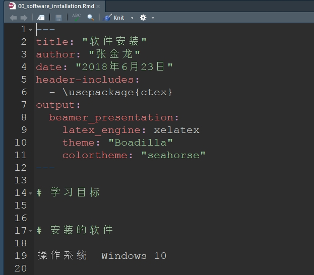{ width=55% }
