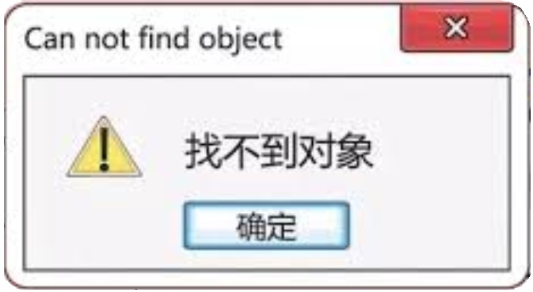

# R中的对象和函数

R中一切皆对象。

数字、字符、因子、函数、运算符，各种要处理的数据类型，在R中均为对象。

R中的对象最好用英文字母开头，不能用数字开头。

{ width=50% }

# 四则运算

* +:加
* -:减
* *:乘
* /:除

```{R}
(2+5)*(15-4.1)
```

# 赋值

* `<-`: 尽量使用
* `=`: 尽量在设定参数时使用
* `->`: 尽量不要用

*赋值符号左右均应留一个空格*

# 元素的类型
* 数值型 `Numeric`: 用户不必区分整数和小数， R会自动判断，如 12, 5000, 3.1415926
* 字符串型`Character`: 如 `"Guangzhou"`
* 因子型`Factor`: 如 某种实验处理，增加光照，不增加光照，就属于因子类型
* 逻辑型`Logical`: 如 导师是否同意报销午餐， 是`TRUE`或否`FALSE`
* 复数型`Complex`: 较少用到。

# 其他类型 NaN, NA, NULL
* `NA`:缺失值
* `NULL`:不存在
* `NaN`:Not a number 非数值
* `Inf`:正无穷

# 基本数据类型

以上基本元素按照一定规律组合，就构成了R中的基本数据类型:

* 向量`vector`: 元素按照一定顺序组合，就构成了向量。注意，单独一个元素也是向量。
* 矩阵`matrix` :同一种类型数据按照行和列排列。
* 数组`array`: 同一种类型数据，按照二维或者多个维度排列，在R中较少用到。
* 数据框`data.frame`: 当多个类型不同，但是长度相同的向量按照列合并，类似于常见的数据记录表。
* 列表`list`: 向量、矩阵、数据框均可放入列表（list）中。列表中也可以放列表。

# 向量的基本操作

向量中的元素必须是相同类型的，如果不相同， 一般会自动转换为字符串类型或者逻辑型。

* `c()`: 生成向量，合并向量
* `length()`: 向量的元素个数，或称为长度。
* `paste()`:合并字符串向量
* `rep()`: 某一个或者几个元素重复指定的次数

```{R}
aaa <- c("a", "b", "c", 1)
length(aaa)
paste(aaa, collapse = "-")
rep(aaa, c(1,2,1,3))
```

# matrix与array

定义matrix有两种方式

* `dim()` 查看matrix的行列数， 也可以用来给向量指定行列，生成matrix

* `matrix()` 生成matrix

```{R}
test <- 1:20
dim(test) <- c(4, 5)
```

查看行列

* `nrow()` 查看行数
* `ncol()` 查看列数

```{R}
dim(test)
nrow(test)
ncol(test)
```

# 数据框 data.frame

`data.frame()`: 生成数据框

`cbind()`: 将某一向量添加到现有的数据框中

```{R}
library(vegan)
data(dune.env)
head(dune.env, 5)
```

# 查看data.frame的属性 
* `nrow()` 查看行数
* `ncol()` 查看列数
* `rownames()` 行名
* `colnames()` 列名
提取某一列， 用`$`加列名即可

在数据框中，各列的长度必须相等
```{R}
dim(dune.env)
colnames(dune.env)
dune.env$Moisture
```

# list 列表

列表中，使用`$`提取某一个已经命名的组件， 列表中的组件可以是 向量、矩阵、数组、数据框以及列表的任意一种。

```{R}
library(vegan)
data(dune.env)
list(dune.env$A1, dune.env$Use)
```

# 列表内元素的命名
```{R}
list(A1 = dune.env$A1, Use = dune.env$Use)
```


# 下标index与索引indexing

下标是一个向量，用来提取基本数据类型中的某一些符合条件的值。

* 对于vector, 使用`[]`
* 对于matrix, 使用`[,]`
* 对于data.frame,使用`[,]`
* 对于list， 使用`[[]]`

可以放置整数型或者逻辑型两种向量:
1. 放置`1，2，3，4`等，表示要提取元素的位置
2. 放置`TRUE`， `FALSE`等，表示是否提取对应的元素

```{R}
letters[1:6]
ind <- letters %in% c("a", "c", "f")
letters[ind]
```


# 比较

比较数值的大小，结果均为逻辑向量

* `==`  判断数值是否相等， 是为`TRUE`, 否为`FALSE`
```{R}
3 == 5
```
* `> `: 判断左侧值是否大于右侧值
* `< `: 判断左侧值是否小于右侧值
* `>=` :判断左侧值是否大于或等于右侧值
* `<=` :判断左侧值是否小于或等于右侧值
* `!=` : 判断左侧值是否不等于右侧值


# 逻辑运算

* `!`:取反
  - `!TRUE` 结果为`FALSE`
  - `!FALSE` 结果为`TRUE`

* `&`:与,表示同时发生
  - `TRUE & TRUE` 结果为`TRUE`
  - `TRUE & FALSE` 结果为`FALSE`
  - `FALSE & FALSE` 结果为`FALSE`

* `|`:或
  - `TRUE|TRUE`结果为`TRUE`
  - `TRUE|FALSE`结果为`TRUE`
  - `FALSE|FALSE` 结果为`FALSE`

# 提取部分数据
使用下标，或者subset函数

```{R}
library(vegan)
data(dune.env)
subset(dune.env, Use == "Haypastu")[1:3,]
dune.env[dune.env$A1 > 6,]
dune.env[dune.env$A1 > 3 & dune.env$Use == "Haypastu",]
```

# 数据类型判断 is.xxx

返回结果为 `TRUE`或者`FALSE`

```R
apropos("is\\.")
is.character() # 是否为字符串？
is.data.frame() # 是否为data.frame？
is.matrix() # 是否为矩阵？
is.vector() # 是否为向量？
is.list() # 是否为列表？
is.logical() # 是否为逻辑类型？
```

# 类型转换 as.xxx

```R
apropos("as\\.")
as.character() # 转换为字符串
as.data.frame() # 转换为data.frame
as.matrix() # 转换为matrix
as.vector() # 转换为vector
as.list() # 转换为list
as.logical() # 转换为逻辑类型
```

# 常用统计分布

* `dbeta`: beta 分布
* `dbinom`: 二项分布
* `dchisq`: 卡方分布
* `dexp`: 指数分布
* `df`: F 分布
* `dgamma`: gamma 分布
* `dnbinom`: 负二项分布
* `dnorm`: 正态分布
* `dpois`: 泊松分布
* `dunif`: 均匀分布

# 统计分布与随机数

* `dxxx`: 概率密度
* `pxxx`: 累积概率
* `qxxx`: 分位数概率
* `rxxx`: 生成随机数

`sample()` 实现随机抽样

```R
sample(x, size, replace = FALSE, prob = NULL)
```
`replace = TRUE`实现有放回抽样，以生成bootstrap样本

```{R}
xxx <- sample(1:20+30, 10, replace = TRUE)
table(xxx) # 计算每个数字出现的次数
```
`set.seed` 设定随机数种子， 以保证每次生成的随机数序列是一致的。

# 流程控制 if() 和 else

`if()`控制条件是否执行

```{R}
x = runif(1)
if(x > 0.5){
   print("Go shopping")
} else {
   print("Do homework")
}
```

# ifelse语句

`ifelse`是`if(){}else{}`的简化版，常用于语句中, 但是会在一定程度上降低程序的可读性
```{R}
x <- c(6:-4)
sqrt(x)  #- gives warning
sqrt(ifelse(x >= 0, x, NA))
```

# for循环

保证花括号中的内容重复一定的次数。

括号内一般放 `i in 1:length()` 或 `j in 1:nrow()`等。

Biocondutor建议用 `i in seq_len(10)`增强程序稳健性。

```R
aaa <- runif(20)
for (i in 1:length(aaa)){
   if(aaa[i] > 0.5){
      print(paste("Number:", i, 
        "The value is less than 0.5"))
   } else {
      print(paste("Number:", i, 
        "The value is greater than 0.5"))
   }
}
```

# while循环

用于不知道要进行多少次循环的情况:
```{R}
i = 0
res = 0
while(i < 101){
   res = res + sum(1:i)
   i = i + 1
}
res
```


# switch 分枝选择
绝大部分可以用`if else`代替，但是后者代码稍冗长
```{R}
centre <- function(x, type) {
  switch(type,
         mean = mean(x),
         median = median(x),
         trimmed = mean(x, trim = .1))
}
x <- rcauchy(10)
centre(x, "mean")
centre(x, "median")
```

# all 和 any
判断是否全部为真， 或者任意一个为真

```{R}
aaa <- sample(1:100 > 90, 10) # 运算符的优先次序
all(aaa)
any(aaa)
```


# 去重复Unique

```{R}
b1 <- sample(1:20, 20, replace = TRUE)
table(b1)
unique(b1)
```

# 排序sort与order
```{R}
library(vegan)
data(dune.env)
sort(dune.env$A1)
# 按照A1的值排序
dune.env[order(dune.env$A1),]
```

# apply函数家族

最常用的为apply

```{R}
library(vegan)
data(BCI)
apply(BCI,MARGIN = 1, sum ) # 每个样方的个体数
apply(BCI,MARGIN = 2, sum ) # 每个种的个体数
```

# tapply

```{R}
# 各因子每个水平下运行sum函数
tapply(warpbreaks$breaks, warpbreaks[,-1], sum)
```

# 运算符的优先次序

类似于四则运算优先次序

* `()[]`最高
* `^ `其次
* `*/+-` 再次
* `==, !=` 低
* `|, &` 最低
任何不清楚优先等级的， 都应该用()控制

```{R}
(2 + 3)^2 - (5 + 12)/9 == 20
```


# 字符串操作

* `nchar`: 字符串中的字符数
* `cat`: 连接字符串，并输送到设备中
* `paste`: 合并字符串
* `substr`: 按照下标提取字符串的一部分
* `substring`: 按照下标提取字符串的一部分
* `strsplit`: 按照匹配规则拆分字符串
* `gsub`: 替换
* `grepl`: 返回一个逻辑值
* `grep`:  返回匹配的id
* `agrep`: 返回匹配的id
* `toupper`: 全部转换为大写
* `tolower`: 全部转换为小写

# 正则表达式 Regular Expression

__“名余曰正则兮，字余曰灵均”__ -- 屈原 《离骚》

但是正则表达式跟屈原没有关系。

正则表达式用于字符串的查找与替换。能够按照一定规则过滤所需要的字符。正则表达式中区分大小写。

在Perl, Python, Ruby, JavaScript等语言中都已实现。

# 常用正则表达式

```R
?regex
```

```
[:punct:]
Punctuation characters:
! " # $ % & ' ( ) * + , - . / : ; < = > ? @ [ \ ] ^ _ ` { | } ~.
```

# 字符串处理举例

巴拿马BCI样地所有物种中，各字母所占比例

```{R}
library(vegan)
data(BCI)
species <- colnames(BCI)
all_chars <- paste(species, collapse = "")
sort(table(strsplit(all_chars, split = "")))
```

#   

\begin{center}
\LARGE{\textbf{练习与答疑}}
\end{center}
