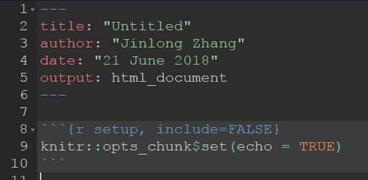
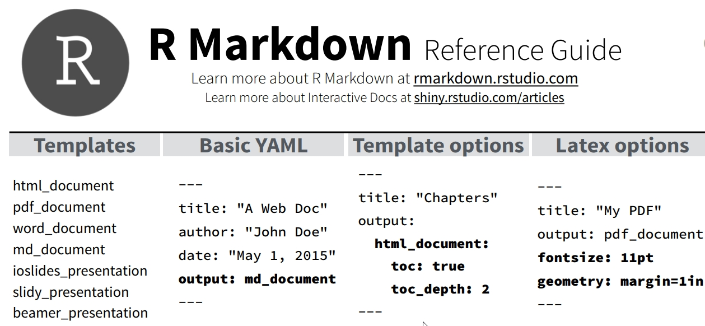

# 为什么要学习Rmarkdown？

Markdown是一种简单的标记语言。R markdown是嵌入了R代码的markdown语言，可以转换为多种格式。

1. 可重复性研究 Reproducible research
  - <https://cran.r-project.org/web/views/ReproducibleResearch.html>
  - <https://ropensci.org/>

2. 编写R程序包的使用指南。R Markdown是编写Vignettes的首选。

3. 分享文档
  - https://rpubs.com/

4. 制作电子书，博客，个人网站等
  - https://bookdown.org/
  - https://bookdown.org/yihui/blogdown/

# TeX和LaTeX

*  在Markdown文档发明以前，已经有html，latex等各种标记语言。

*  很多开源程序的文档是用latex编写的，包括R语言各函数的帮助文件，R程序包使用指南Vignettes只能用Sweave编写。Sweave是一种整合了R脚本的LaTeX文件。

*  Tex是美国科学家Donald Knuth编写的排版系统，最早发布于1978年，最初主要用于排版有数学公式的图书和论文等。

*  但TeX较为复杂，为了降低使用难度，美国科学家Leslie Lamport为Tex增加很多宏，就形成了LaTeX。

# LaTeX源文件和Reproducible research

Latex的源文件用纯文本编写，可使用pdflatex, xelatex等组件编译成pdf。

书写latex文档与编程有些相似。latex源代码中嵌入R语言或其他语言后，每一次编译都重新生成文档。Latex的优势在于用户可以使用现成的模版和宏包直接编译文档，而不必担心格式问题。

不过，因为要记住的命令仍然较多，很容易出错，在一定程度上看，直接编写latex文档的效率并不高。

# Markdown 文档

Markdown标记语言正是为了解决这个问题诞生的。Markdown文档用纯文本书写，通过精心设计的简单字符标记，就能标出文档格式要素。

Markdown由John Gruber设计出来以后，很快受到程序员、科学家、作家的欢迎。与Markdown相关的软件与文档也迅速增加。

参考：
*  https://markdown-zh.readthedocs.io/en/latest/
*  http://wowubuntu.com/markdown/

# Markdown 文档中的元素

-  题目：通过YAML文件头设置
-  作者：通过YAML文件头设置
-  标题：# 一级标题，## 二级标题
-  段落：上下有空行的文字自动成为一段
-  文字引用：每行前面添加>作为块引用
-  列表：文字之前加 1. ,* , -， + 即可自动识别为列表
-  代码块：自动高亮
-  水平线：连续三个***
-  链接：`[an example](http://example.com/ "Title")`
-  强调：包围在两个`*,_,**,__` 之间，会分别转为斜体或加粗
-  图片：``
-  链接：将网址放入<>即可自动转换为链接

# Markdown 文档3：需要转义的字符

转义符：由于以下字符是用在Mardown标记中， 如果要在Markdown文档中显示这些字符，就需要使用转义符\\

*  `\ `：backslash 反斜杠
*  `` `：backtick 反引号
*  `* `：asterisk 星号
*  `_ `：underscore 下划线
*  `{}`：curly braces 花括号
*  `[]`：square brackets 方括号
*  `()`：parentheses 括号
*  `# `：hash mark 井号
*  `+ `：plus sign 加号
*  `- `：minus sign (hyphen) 减号、连字符
*  `. `：dot 英文句号
*  `! `：exclamation mark 感叹号

# Markdown文档的YAML标记

设定题目和作者，编译方式，用YAML语言

```YAML
---
title:  'This is the title: it contains a colon'
author:
- Author One
- Author Two
tags: [nothing, nothingness]
abstract: |
  This is the abstract.

  It consists of two paragraphs.
...
```
更多内容参见Pandoc的帮助文件
https://pandoc.org/MANUAL.html

# Pandoc软件

Pandoc 是进行文件格式转换的软件。

Pandoc可以驱动Latex，将Markdown转换为pdf文件，也可以直接将markdown文档转换为latex, html或者docx，epub等，实现了文档格式之间的相互转换。

```sh
pandoc test.txt -o test.pdf
```
Pandoc能够转换的格式可参考：
<https://pandoc.org/index.html>

Rstudio通过内置的pandoc软件实现不同格式之间的转换。

# R Markdown文档

R Markdown是Markdown语言的进一步发展，借助knitr和rmarkdown程序包， 整合了R脚本的markdown文档可以很好地编译，并转换为html、pdf、docx等格式。

R Markdown文档中，嵌入的R代码，称为chunk。花括号中可以设置各种参数，控制R代码是否显示，是否运行，要显示图片的大小等。

{ width=60% }


# R Markdown文档的YAML

R Markdown有自己的YAML表头，控制标题，作者，日期，文档编译的方式和类型以及相应参数等。

{ width=90% }


# 本文档的YAML表头

```YAML
---
title: "R Markdown文档"
author: "张金龙"
date: "2018年6月23日"
header-includes:
  - \usepackage{ctex}
output:
  beamer_presentation:
    latex_engine: xelatex
    theme: "Boadilla"
    colortheme: "seahorse"
---
```

#   

\begin{center}
\LARGE{\textbf{练习与答疑}}
\end{center}
