# R程序包是什么？

按照Writing R Extension文档所编写的一系列R函数、数据及其文档等组成的文件夹及其所有文件，或该文件夹的gz或zip压缩文件。

程序包有几种状态：

1.  源代码
2.  压缩的源代码包，多为gz格式
3.  Windows包
4.  MacOS包
5.  安装到计算机后的版本

# 为什么要写程序包?

1.  为了让分析工具更系统
2.  为了让每一个需要的函数都有良好的文档，大部分情况下，如果不写好文档，过一段时间自己都完全不记得了。
3.  为了共享分析工具
4.  可重复研究
5.  挑战黑科技...

# 核心包和扩展包

安装R运行平台后，默认只安装了用于计算、统计与绘图的基本程序包。包括：
```
base, compiler, datasets, graphics, grDevices,
grid, methods, parallel, splines, stats,
stats4, tcltk, tools, utils, boot,
cluster, foreign, MASS, Matrix, mgcv,
nlme, nnet, rpart, survival, boot,
class, cluster, codetools, foreign, KernSmooth,
lattice, MASS, Matrix, mgcv, nlme,
nnet, rpart, spatial, survival等
```
用`installed.packages()`函数可查看已安装了哪些程序包


# R程序包的主要网站

*  CRAN：最大的R包集成网络
*  Bioconductor： 主要用于生物信息学分析和数据分享
*  Rforge： 主要用于R包开发，用svn进行版本控制，自动编译和检查程序包
*  github： 主要用于R包开发，用git进行版本控制，只提供源代码

截止到2018年6月20日，CRAN上共有12630个R程序包
https://cran.r-project.org/web/packages/index.html

# CRAN Task Views 和安装某一类的程序包

CRAN Task Views （截止到2018年6月20日，共36个CRAN Task Views）
https://cran.r-project.org/web/views/

```R
library(ctv)
ctv::install.views("Environmetrics")
ctv::install.views("Phylogenetics")
ctv::update.views("Econometrics")
```

# Bioconductor上的程序包

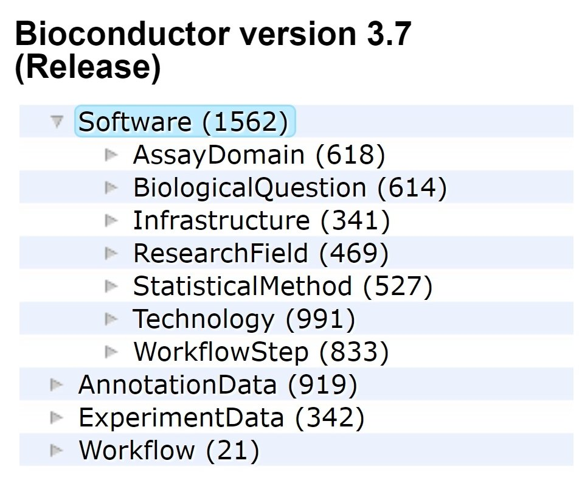{ width=70% }


# R程序包的基本结构

* DESCRIPTION 文件
* NAMESPACE 文件
* R 文件夹
* man 文件夹
* vignettes 文件夹，用于保存Rmd文档或者LaTeX文档
* data 文件夹
* inst/extdata 文件夹

Writing R extensions https://cran.r-project.org/doc/manuals/r-release/R-exts.html

# DESCRIPTION 文件1

主要用于说明程序包的用途， 作者（contributor），以及维护人（maitainer），程序包的依赖关系，许可证等。

格式为 DCF, 为the Debian Control Format的缩写。

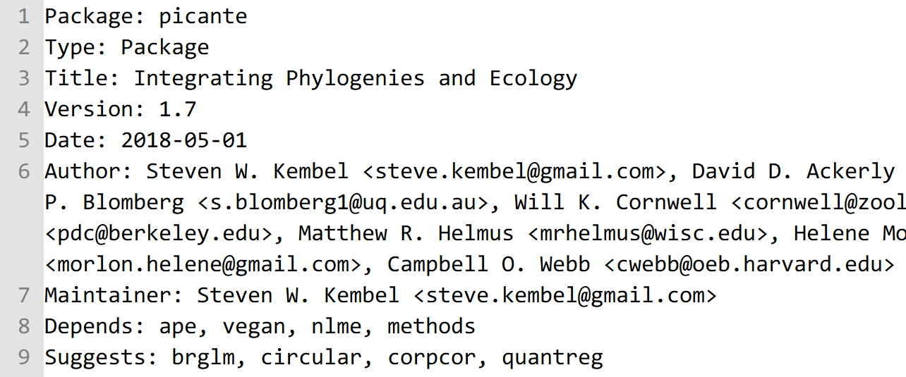{ width=85% }

# DESCRIPTION 文件2

过去，DESCRIPTION文件一般是用package.skeleton函数模版生成的，开发者只需要修改其中的参数即可。

现在也用`devtools::create_description()` 或者 `devtools::create()` 生成。

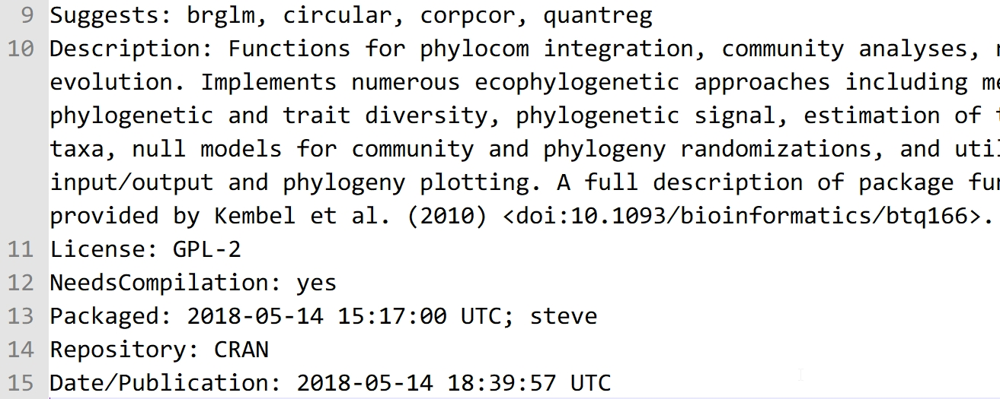{ width=85% }

# Description文件举例

```
Package: anRpackage
Type: Package
Title: What the package does (short line)
Version: 1.0
Date: 2018-06-23
Author: Who wrote it
Maintainer: Who to complain to <yourfault@somewhere.net>
Description: More about what it does 
  (maybe more than one line)
License: What license is it under?
```
# License 许可证

任何一个软件，需要开发者或者版权所有人授予使用权，用户才能使用。对于开源的R软件来说更是如此。

目前，R程序包常用的许可证为：
 ```
 GPL-2, GPL-3, LGPL-2, LGPL-2.1, LGPL-3, AGPL-3, Artistic-2.0, BSD_2_clause, BSD_3_clause, MIT.
 ```

一般选用`GPL-2`或`GPL-3`，也可选择`MIT`。

GPL系列许可证意味着别人可以使用和修改你的源代码，但是他的程序必须仍然为开源， MIT许可证则没有这种限制。

# 程序包的依赖关系

若所编写程序包的函数中使用了其他程序包中的函数或数据，就构成了程序包的依赖，此时需要在DESCRIPTION文件中做出相应的说明，以便在安装程序包时自动安装上有依赖关系的程序包。

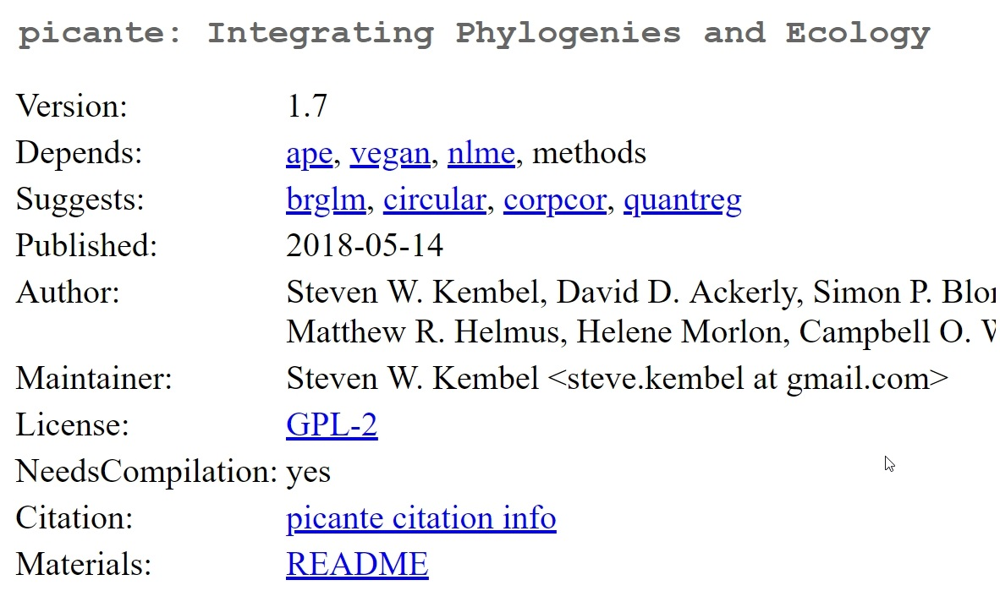{ width=70% }

# 程序包的依赖关系: Depends, Imports 和 Suggests

常见有三种情况：

*  Depends：程序包使用了其他程序包所定义的类class， 或者程序包必须在R的某一个版本之后才能正常工作。此时，需要设定所依赖的程序包为Depends，以便用`library()`导入本程序包时， 所依赖的程序包自动attach，保证所有函数和数据可直接调用。
*  Imports：如果程序包的函数只使用了其他程序包的部分函数，用library()读取该程序包后，只需要将函数或者数据import， 而无需全部导入。
*  Suggests: 程序包只在函数的Example或者vignettes中使用了所依赖函数的内容，则放入Suggests。

Suggests的程序包使用install.packages()时，默认不安装。

要安装suggests的程序包，使用以下命令：
```R
install.packages("apackage", dependencies = TRUE)
```

# NAMESPACE文件：函数名冲突与覆盖

不同程序包常会出现相同的函数名，在用`library()`函数导入程序包后，用函数名调用的究竟是哪个函数？

NAMESPACE就是为了解决这个问题。

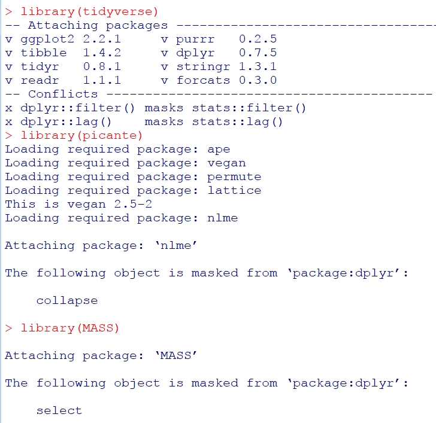{ width=40% }


# NAMESPACE文件

在编写R函数时，一些函数我们并不一定希望用户看到，而是作为Utility Functions。如果将这些函数全部放到主函数当中，主函数将显得十分“臃肿”。

NAMESPACE中可以控制export出哪些函数，只为export出的函数写帮助文档，避免了函数和程序的“臃肿”。

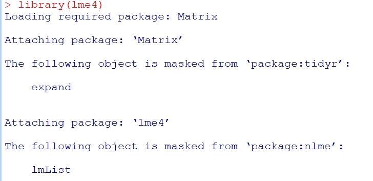{ width=75% }


# NAMESPACE文件

常用关键词为:

*  `import`: 导入依赖的整个程序包
*  `importFrom`: 导入所依赖程序包的某几个函数
*  `export`: 导出本程序包中哪些函数，即让用户可见
*  `S3method`: S3对象
*  `exportClasses`: S4对象
*  `exportMethods`: S4方法

# picante的NAMESPACE文件
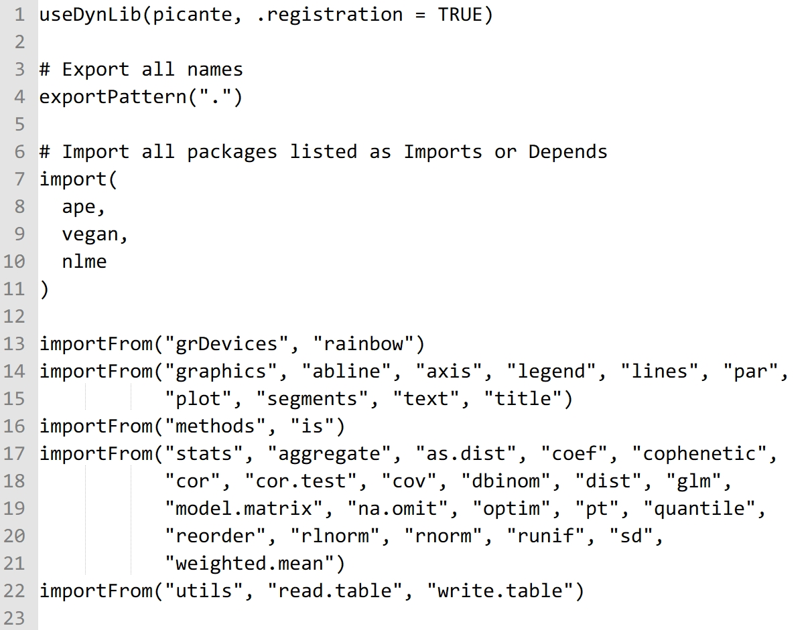{ width=75% }

# R文件夹

用来保存R函数的源代码，一般来说，有两种组织方式：

1.  每个函数独立保存为R文件，文件以函数名命名。适用于函数较少的情况。一般通过`package.skeleton()`即可做到。

2.  若干函数保存到一个R文件，文件以类别命名。适用于函数较多，以及使用了S3，S4等面向对象编程的情形。

# man 文件夹

*  man文件夹用于保存每个函数的帮助文件，扩展名为.Rd。

*  若函数在NAMESPACE文件中已经导出，则必须为该函数提供使用说明。Rd文件与LaTeX的语法接近。

*  R对象帮助文件的模版可以通过`prompt()`函数生成。

*  用文本编辑器直接编辑Rd文件简单直接，但是函数在更新以后，如果参数发生变化，更新Rd文件会比较麻烦
为此Rd文件可以借助roxygen2程序包生成。

# Rd文件示例

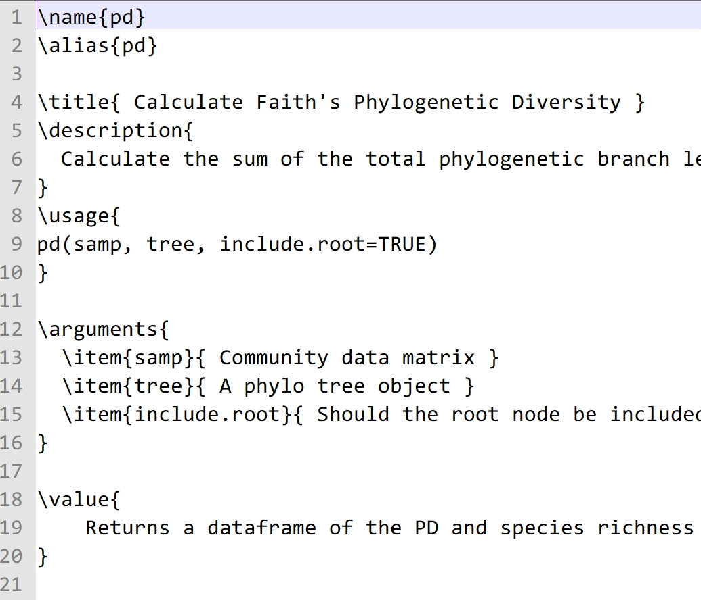{ width=60% }

# vignettes文件夹

vignettes主要是让用户从总体上更好地理解程序包中的函数是如何组织起来进行一系列复杂分析的，特别是要让用户熟悉数据分析的流程与原理等。

*  保存程序包vignettes源文件。

*  源文件必须为Rnw文件或者Rmd文件。

*  .Rnw文件为Sweave文档，会通过Latex编译为PDF。

*  .Rmd文件会通过knitr和rmarkdown包转换为html文件。Rmd文件也就是R Markdown文档。

# R Markdown vignettes文件

Vignettes文件与普通Rmarkdown文档不同之处在于YAML文件头的差异。有固定格式

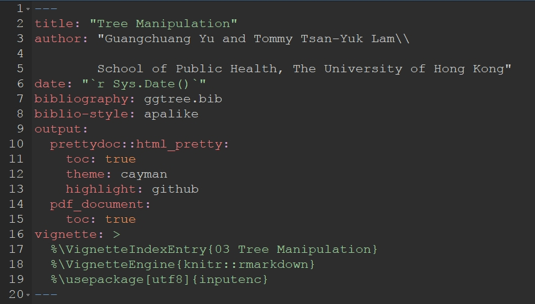{ width=80% }

# data文件夹

*  如果想让用户用 `data()`访问数据， 需要将Rda二进制文件放在data文件夹中。

*  Rda文件内部多为data.frame, list或者vector等数据类型，以data.frame较为常见。

*  Rda文件除通过`package.skeleton()`函数生成之外，也可通过`save()`生成。


# inst/extdata 文件夹 和 src文件夹

*  inst/extdata文件夹一般用来保存rda格式以外的数据类型，如制表符间隔的txt、csv、xls、xlsx文件等。但是由于CRAN policy的限制，用户已经不能在示例中直接读取这些文件。

*  src文件夹用于保存.C, .Cpp, .f等文件。在Windows中，放在src文件夹中的C、C++、 Fortran函数会自动编译为dll文件，供R函数调用。

# Windows下创建R程序包的工具

* Rcmd.exe: 位置`C:\Program Files\R\R-3.5.0\bin\i386`， 通过命令行调用
* Rtools：包含gcc等一系列工具， 用于编译.C, .cpp, .f等文件
* MikTeX： 用于生成PDF版本的Manual，或vignettes等，在检查中也会用到
* devtools程序包：主要提供创建、安装、检查程序包的函数，以及从github安装程序包的函数等
* Rstudio： 提供建立R程序包的集成环境

# Windows下Rcmd的操作

从源代码创建Linux包
```sh
Rcmd build picante
```
创建Windows下的包
```sh
Rcmd INSTALL --build picante
```
检查程序包是否有问题
```sh
Rcmd check picante
Rcmd check --as-cran picante
```
安装程序包
```sh
Rcmd INSTALL picante
```
一般将命令保存为.bat文件，放在程序包源代码所在的文件夹下，之后双击.bat文件即可运行。

# 编译程序包
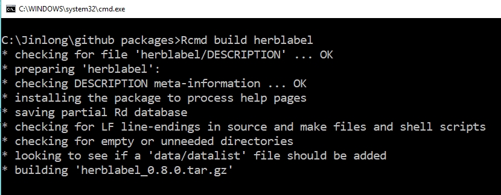{ width=85% }

# 检查程序包
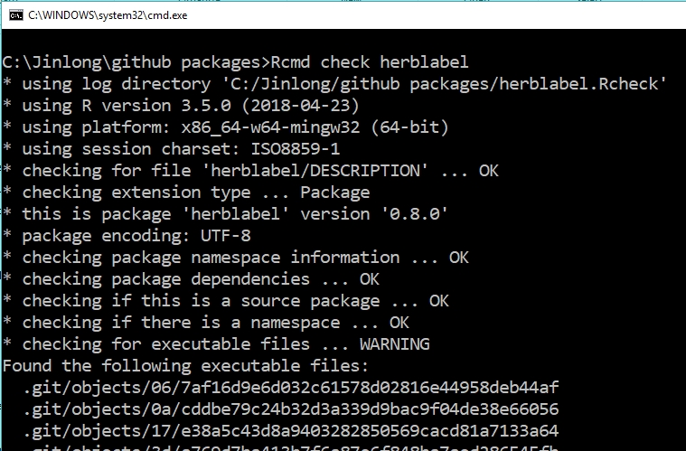{ width=85% }

# 过去的工作流程

* 用`package.skeletons()`创建程序包骨架
* 添加R函数到 R/ 文件夹下
* 修改NAMESPACE文件，指定导入和导出的函数
* 修改DESCRIPTION文件
* 手工修改Rd文件
* 用LaTeX Sweave编写使用指南

主要参考: Writing R Extensions,  `RShowDoc("R-exts")`

# Wickham推荐的工作流程

ggplot2的作者Wickham 推荐用Rstudio进行程序包开发 (http://r-pkgs.had.co.nz/)。

```R
getwd()
devtools::create("taxa")
devtools::build()
devtools::check()
devtools::install()
```

# roxygen2使用要点

通过 package.skeletons()函数生成的Rd文件与R函数在不同文件夹中，在R函数更新后，需要进一步手工更新，在函数很多时较为麻烦。

为此，Hadley Wickham提出将R函数的文档信息保存在R脚本的注释中，使用roxygen2的关键词标注，以自动生成或者更新Rd文档。

这样做的好处在于，函数和帮助文档方便一起维护。
```
#'
@details, @param, @return,  @examples document the function
@export 设定该函数是否为用户可见
@import and @importFrom indicate (non-base) functions that are used by this function, e.g,.  @importFrom stats rnorm runif
devtools::document() 生成Rd文件
```

# 测试test:检查程序的正确性与稳定性

*  对任何计算机程序来说，正确性是第一位的。没有经过严格测试的程序包，结果的可信度会大打折扣。

*  因为函数往往比较复杂，开发者要考虑在不同情形下，给出特定的结果，或者输出特定的错误提示。

# 为什么不用R帮助文件中的Example部分做检验？

因为：

*  R example中的代码必须是可正确运行的
*  用户体验：用户查看example一般是为了了解函数能做什么， 而并不关心函数在不同情形下返回什么结果。

因此，相关的测试最好不要放在Example中。

# testthat或者RUnit程序包进行检验

进行测试的R程序包有testthat和RUnit，而testthat比较流行。

* Hadley Wickham. testthat: Get Started with Testing. The R Journal, vol. 3, no. 1, pp. 5--10, 2011

* Matthias Burger, Klaus Juenemann and Thomas Koenig (2018). RUnit: R Unit Test Framework. R package version 0.4.32. https://CRAN.R-project.org/package=RUnit

# testthat程序包

进行测试的R脚本应放在源代码的tests文件夹下的testthat文件夹中。
。
{ width=85% }

# testthat举例

多个类似的test放在一个.R文件中，每个R文件均以context开头，指明要测试的内容。

后面用expect_XXX系列函数测试函数的返回值。

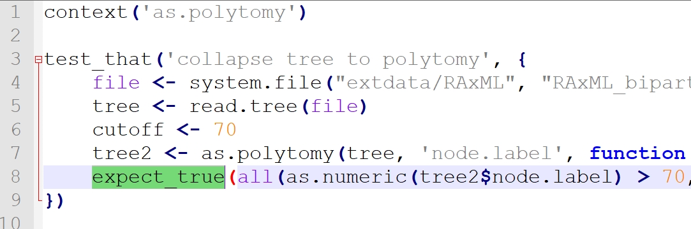{ width=90% }

# testthat的主要函数1

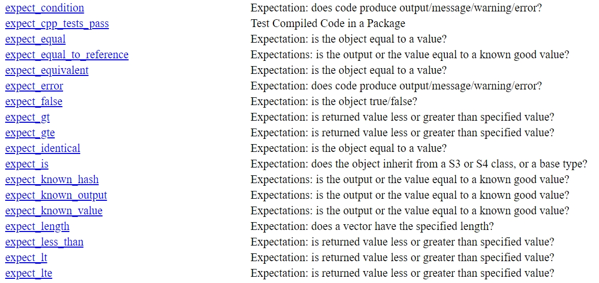{ width=90% }

# testthat的主要函数2

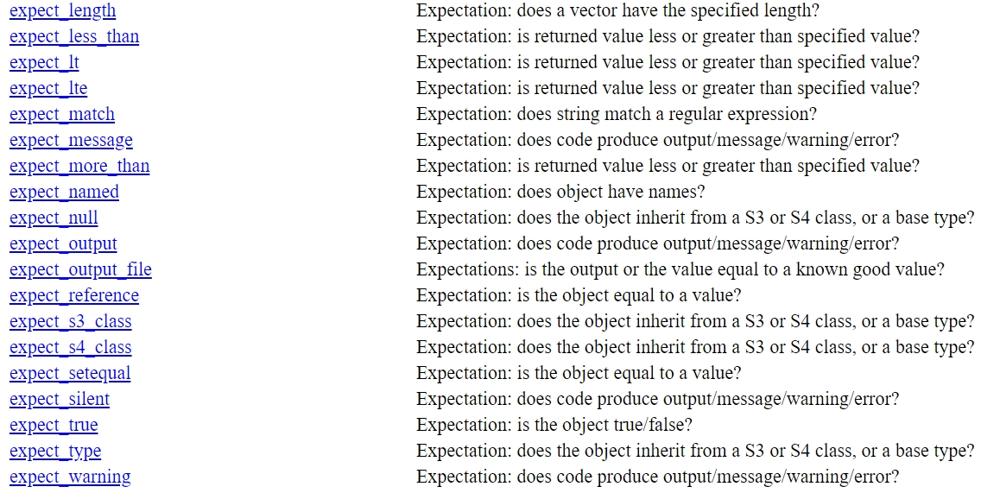{ width=85% }

# 编写R程序包的建议

1. 编写的函数要简单，每一个函数实现一个功能。
2. 任何时候都要处理好异常，以提醒用户输入正确的数据类型以及取值范围。
3. 每个导出的函数都应有example，example中的数据要小，以免运行example的时间过长
4. 名称简洁，看到名称最好就能知道该程序包属于什么领域。
5. 要有完备的vignettes介绍分析流程，注意事项，算法等。

#   

\begin{center}
\LARGE{\textbf{练习与答疑}}
\end{center}
