# R软件版本

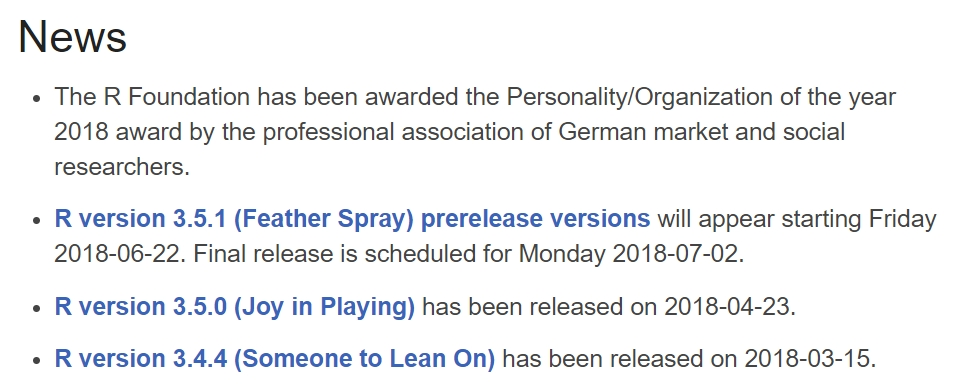{ width=85% }

# R程序包的版本

* 每个R程序包也有自己的版本。

* 引用程序包时，需要指明使用的版本。

* 软件的新版本可能增加了新函数，也可能增加了其他新的功能，去掉了一些旧函数等，各版本之间不一定完全兼容。

```R
> citation("vegan")
To cite package ‘vegan’ in publications use:
  Jari Oksanen, F. Guillaume Blanchet, Michael Friendly, ... (2018). 
  vegan: Community Ecology Package. R package version 2.5-2.
  https://CRAN.R-project.org/package=vegan
A BibTeX entry for LaTeX users is
```

# R程序包的版本

版本号一般由三位组成x.y.z

Biocondutor对于R程序包版本的建议：

*  x: 0表示尚未完全开发好，1.0.0一般为首次公布。
*  y: 偶数表示正式发布的版本, 奇数表示正在开发的版本。
*  z: 新增加了一些功能，较小的变化。

x,y,z分别顺序增加

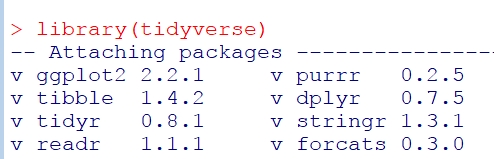{ width=60% }

# 版本控制

*  对软件源代码进行修改时，编程人员希望记录每一步重要修改。

*  类似于登山时，每向上走一步，都增加一个锚定点，在从这个锚定点出发，继续攀登。

*  如果没有版本控制软件，一旦做出的修改出现致命错误，就无法返回，也无法记录修改的过程。

*  大家熟悉的MS office软件，有前进后退，但是对于纯文本文件，如何记录修改历史？


# 版本控制软件


版本控制软件种类繁多（https://en.wikipedia.org/wiki/List_of_version_control_software）。

目前在开源软件中，最常用为git和svn。

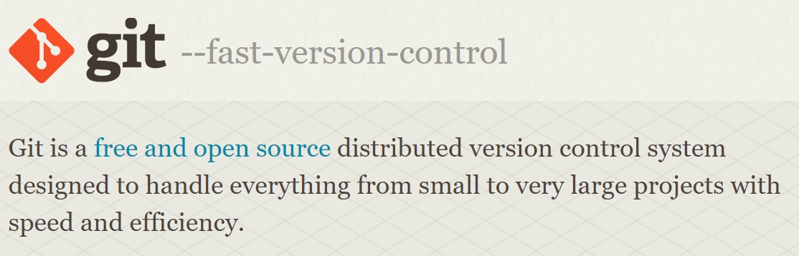{ width=85% }

# 为什么要用git？

* git支持多分支同时开发
* git支持复杂的文件结构和大文件，且十分稳定。在没有网络时，仍然可以工作
* git软件是开源的，不收取费用
* git操作检验，很容易学会
* github网站支持用git分享代码和课程资料
* 别人也在用git
* ……

# git的基本操作

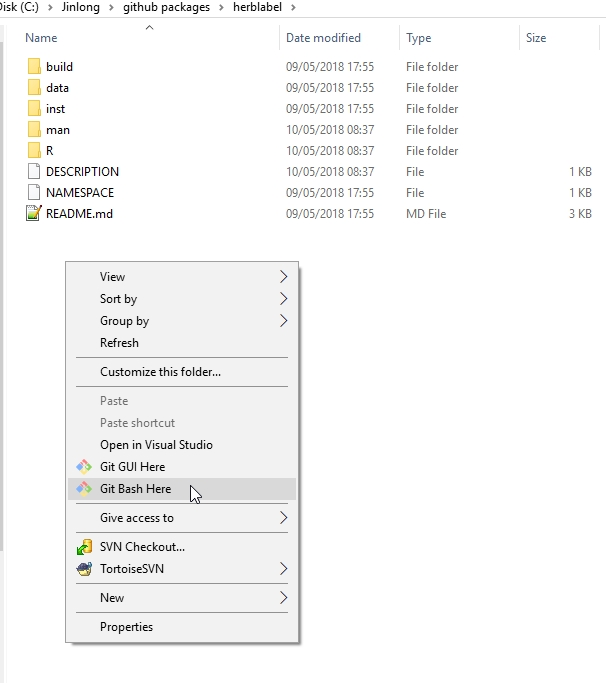{ width=40% }

# git的查看代码的状态（修改前）

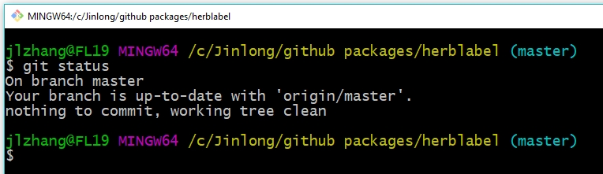{ width=90% }

# git的查看代码的状态（修改后）

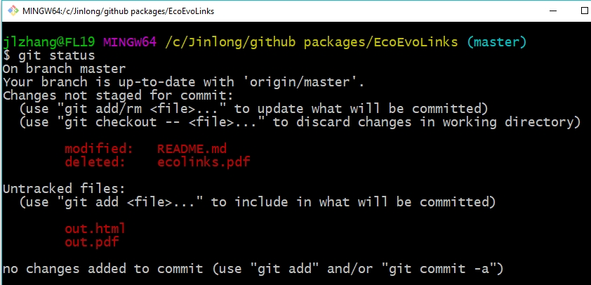{ width=90% }

# 常用git命令

* `git clone`: 从某处克隆一个git repository
* `git status`: 修改之后，查看当前分支的状态
* `git add`: 添加修改
* `git commit -m "XXXX"`: 提交修改
* `git checkout`: 选择工作分支
* `git rm`: 删除文件
* `git diff`: 显示版本的差异
* `git pull`: 从远程仓库更新代码
* `git push`: 将修改更新到远程仓库

# 远程仓库 Github

前不久，微软75亿美元收购了github ...

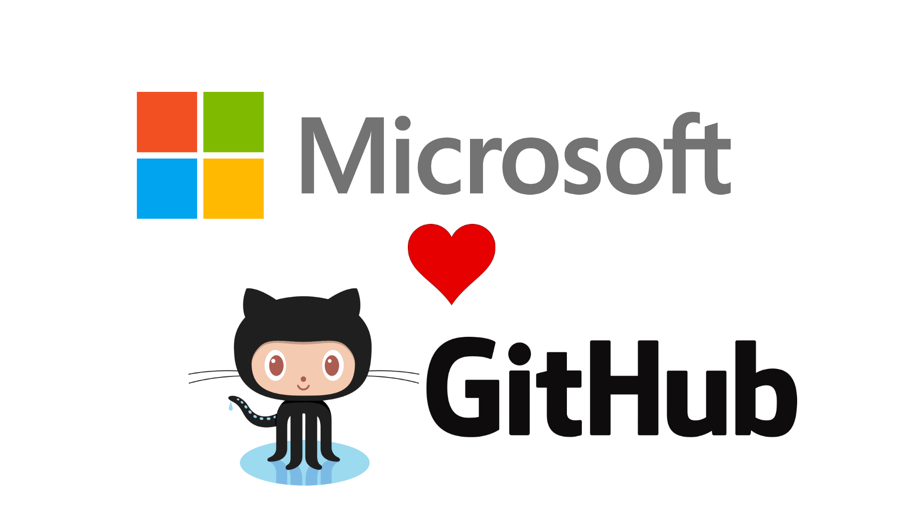{ width=80% }

# Github

Github的主要功能是分享和收藏资源，也可以建立个人网站。对开源项目完全免费。

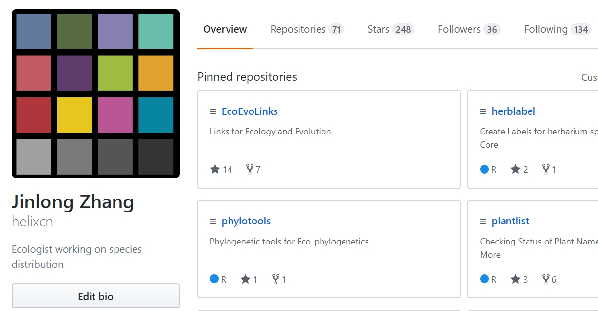{ width=80% }


# github上分享R包源代码

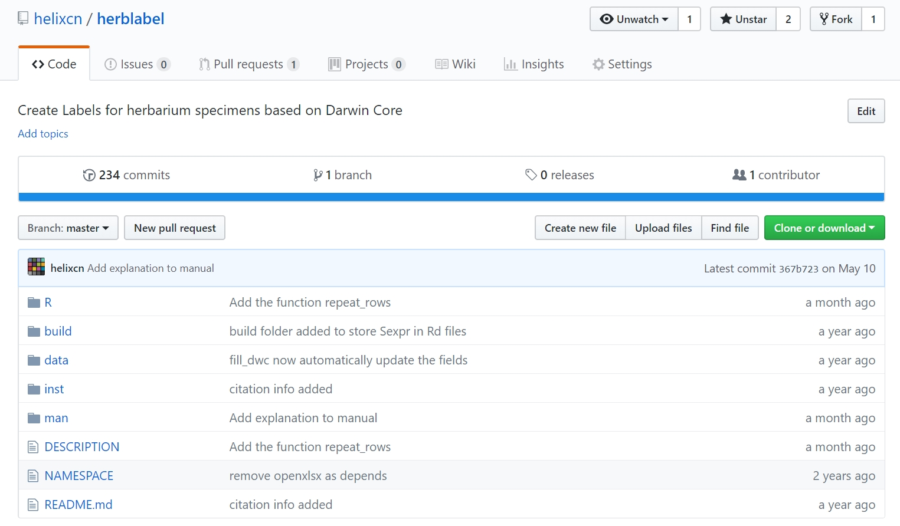{ width=85% }


# github上的R程序包

*  分享在github上的程序包，可以通过`devtools::install_github()`安装。

*  github上的版本一般为正在开发的最新版本，用户可以尝试一些新的功能等。

*  程序包可能有很多作者，分别负责一部分。在github上，每个人可fork不同分支，然后分别开发，之后将不同分支合并(merge)到主分支master上。

*  通过git即可完成上述操作。

# R-Forge

R-Forge 是R程序包版本管理的网站。

在提交到CRAN之前，用户可以在R-Forge创建项目，批准后即可上传源代码。

R-Forge用SVN系统管理代码。在Windows下可以使用Tortoise svn管理。

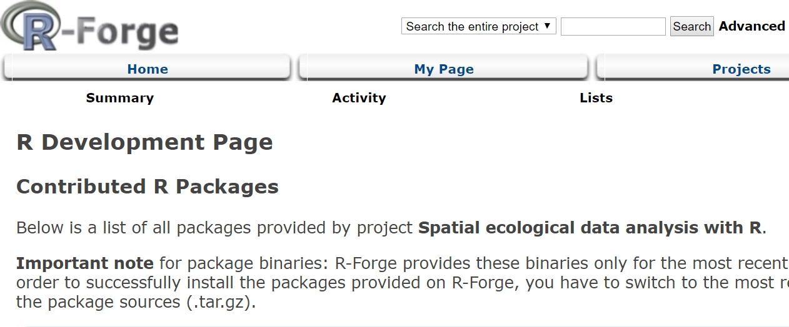{ width=80% }

# R-Forge上的代码及其安装

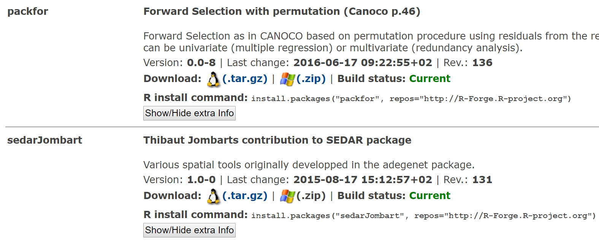{ width=80% }

# Tortoise SVN
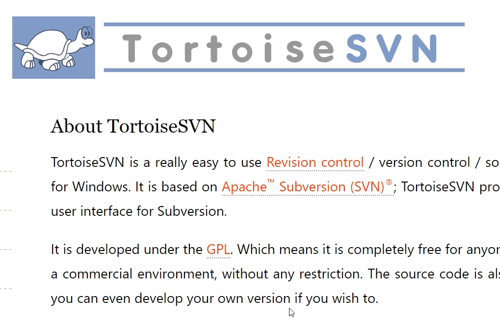{ width=80% }

# Tortoise SVN的主要命令

* `svn checkout` 指定要工作的远程库，并获取相应文件
* `svn add` 添加文件到远程库
* `svn commit` 为修改添加相应标签
* `svn update` 将本地文件更新到最新版本
* `svn status` 查看修改状态
* `svn delete` 删除文件
* `svn log` 查看日志
* `svn diff` 比较不同版本
* `svn merge` 合并不同分支
* `svn help` 查看帮助


#  

\begin{center}
\LARGE{\textbf{练习与答疑}}
\end{center}


#  

\begin{center}
\LARGE{\textbf{谢谢！}}

\LARGE{\textbf{敬请批评指正！}}
\end{center}
